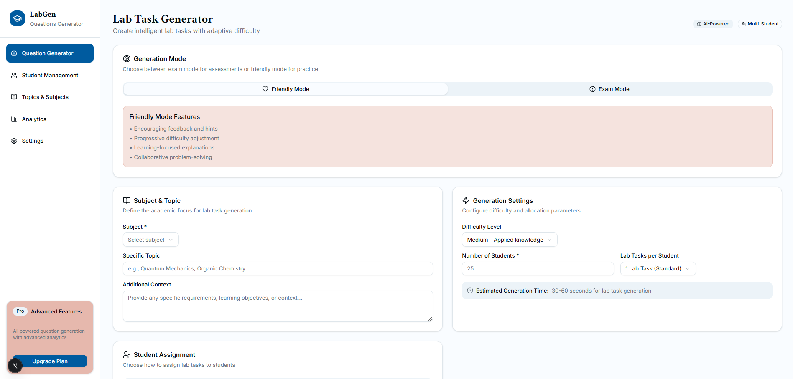
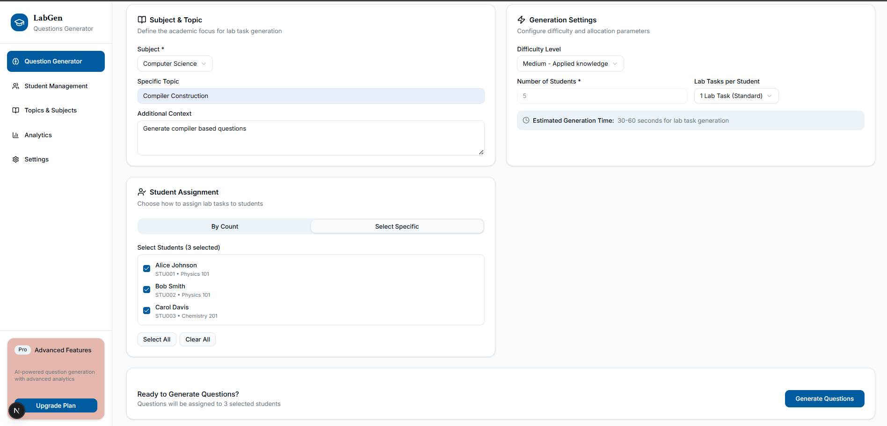
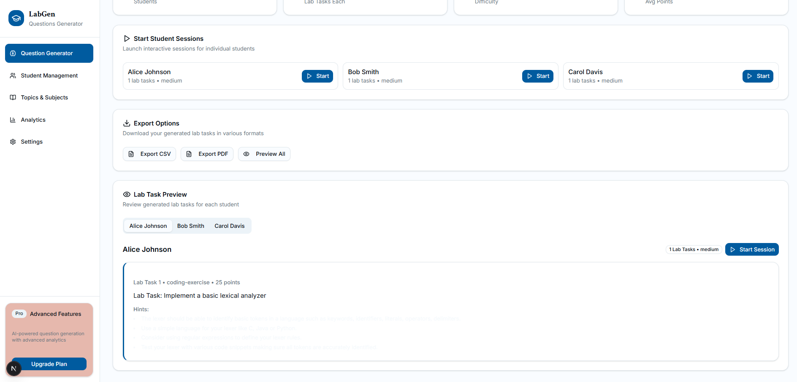
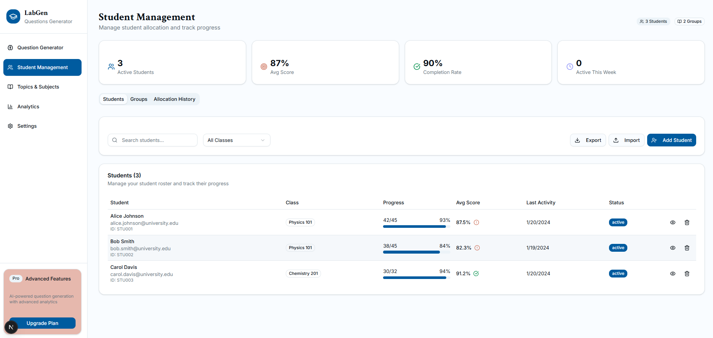
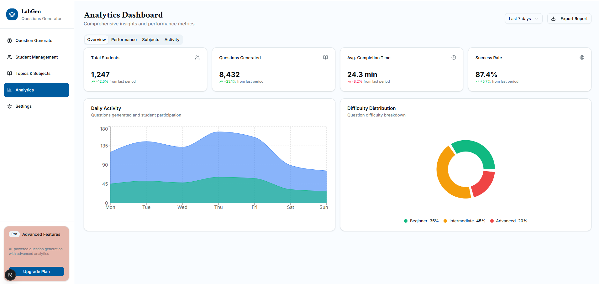
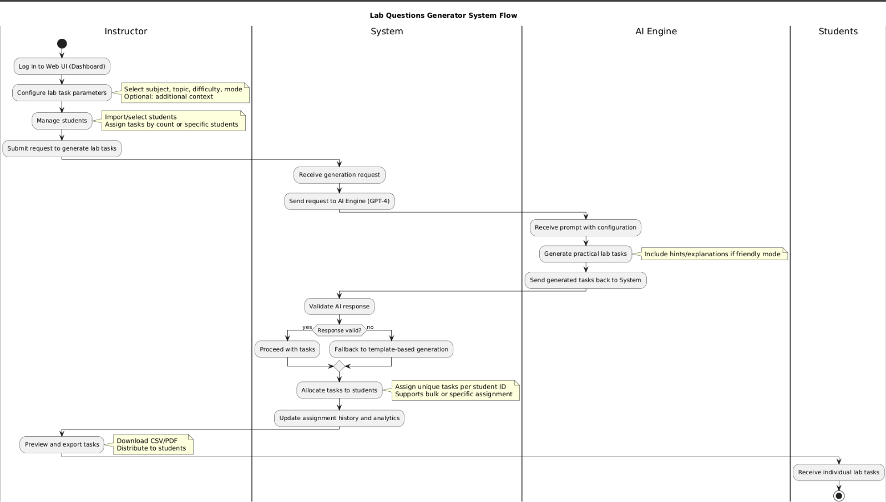

# 🧪 Lab Questions Generator

An intelligent AI-powered platform for generating customized laboratory tasks and assignments for educational institutions. This Next.js application leverages OpenAI's GPT-4 to create practical, hands-on lab exercises tailored to specific subjects, difficulty levels, and student requirements.


## 📸 Screenshots

### Dashboard Overview


### Lab Task Generation Interface


### Generated Lab Tasks Preview


### Student Management


### Analytics



## 🔄 System Flow Diagram

### Visual Flow Diagram


### Textual Flow (for accessibility and quick reference)
```
┌─────────────────┐    ┌─────────────────┐    ┌─────────────────┐
│   Instructor    │    │   AI Engine     │    │   Students      │
│   Interface     │────▶│   (OpenAI GPT-4)│────▶│   Assignments   │
└─────────────────┘    └─────────────────┘    └─────────────────┘
         │                       │                       │
         ▼                       ▼                       ▼
┌─────────────────┐    ┌─────────────────┐    ┌─────────────────┐
│ Subject & Topic │    │ Lab Task        │    │ Individual      │
│ Configuration   │    │ Generation      │    │ Task Sheets     │
└─────────────────┘    └─────────────────┘    └─────────────────┘
         │                       │                       │
         ▼                       ▼                       ▼
┌─────────────────┐    ┌─────────────────┐    ┌─────────────────┐
│ Difficulty &    │    │ Quality         │    │ Export &        │
│ Mode Selection  │    │ Validation      │    │ Distribution    │
└─────────────────┘    └─────────────────┘    └─────────────────┘
```

## ✨ Features

### 🎯 Intelligent Lab Task Generation
- **AI-Powered Content Creation**: Utilizes OpenAI's GPT-4 to generate practical, hands-on laboratory tasks
- **Subject-Specific Tasks**: Supports multiple disciplines including Physics, Chemistry, Biology, Mathematics, Computer Science, and Engineering
- **Practical Focus**: Creates actionable lab exercises with clear deliverables and objectives
- **Quality Assurance**: Built-in validation ensures generated tasks meet educational standards

### 👥 Student Management System
- **Individual Assignment**: Assign unique lab tasks to specific students by ID
- **Bulk Generation**: Create tasks for entire classes with customizable student counts
- **Student Roster Integration**: Import and manage student information including names, IDs, emails, and class sections
- **Assignment History**: Track allocation history and previous task assignments
- **Active/Inactive Status**: Manage student enrollment status

### 🎚️ Adaptive Difficulty System
- **Easy Level**: Basic implementation with clear step-by-step guidance (10-15 points)
- **Medium Level**: Intermediate tasks requiring problem-solving and application (20-30 points)
- **Hard Level**: Complex projects involving multiple concepts and advanced implementation (35-50 points)
- **Dynamic Point Allocation**: Automatic scoring based on complexity and difficulty

### 🧠 Dual Generation Modes

#### 📚 Friendly Mode
- Encouraging feedback and hints
- Progressive difficulty adjustment
- Learning-focused explanations
- Collaborative problem-solving approach
- 3-4 helpful implementation hints per task
- Detailed methodology guidance

#### 📝 Exam Mode
- Formal assessment structure
- Standardized difficulty levels
- Comprehensive evaluation criteria
- Time-limited response expectations
- Professional assessment format

### 📊 Advanced Analytics & Export
- **Comprehensive Reporting**: Detailed statistics on task generation and student allocation
- **Multiple Export Formats**: CSV and PDF export capabilities
- **Preview System**: Interactive preview of all generated tasks before distribution
- **Metadata Tracking**: Complete audit trail including generation timestamps, difficulty levels, and assignment details

### 🔧 Task Type Variety
- **Practical Tasks**: Hands-on laboratory exercises
- **Coding Exercises**: Programming and implementation challenges
- **Design Tasks**: Creative and engineering design projects
- **Implementation Projects**: Real-world application development
- **Analysis Tasks**: Data analysis and research assignments

## 🤖 How AI is Used

### OpenAI GPT-4 Integration
The application leverages OpenAI's GPT-4 model to generate high-quality, contextually relevant lab tasks:

#### 1. **Intelligent Prompt Engineering**
```javascript
// Sophisticated system prompts for lab task generation
const systemPrompt = `You are an expert lab instructor creating practical, 
hands-on exercises for ${subject}. Generate ${count} unique LAB TASKS/EXERCISES 
about "${topic}" at ${difficulty} level...`
```

#### 2. **Context-Aware Generation**
- **Subject Specialization**: AI adapts language and terminology based on the selected academic subject
- **Difficulty Calibration**: Automatic adjustment of task complexity based on difficulty level
- **Practical Focus**: AI ensures tasks are hands-on and include clear deliverables
- **Educational Standards**: Built-in quality checks ensure tasks meet pedagogical requirements

#### 3. **Dynamic Task Variation**
- **Unique Content**: Each student receives a distinct task even for the same topic
- **Contextual Adaptation**: AI considers additional context and requirements provided by instructors
- **Progressive Complexity**: Tasks build upon foundational concepts while introducing new challenges

#### 4. **Quality Assurance Pipeline**
```javascript
// AI response validation and fallback system
try {
  const aiResponse = await openai.chat.completions.create({
    model: "gpt-4",
    messages: [...],
    temperature: 0.8,
    max_tokens: 2000,
  });
  // Validate and process AI response
} catch (error) {
  // Fallback to template-based generation
  return generateFallbackQuestions(...);
}
```

#### 5. **Adaptive Learning Support**
- **Hint Generation**: AI creates contextual hints for friendly mode
- **Methodology Guidance**: Provides step-by-step approaches for complex tasks
- **Error Prevention**: Identifies potential pitfalls and includes preventive guidance

## 🚀 Getting Started

### Prerequisites
- Node.js 18+ 
- npm or pnpm
- OpenAI API key

### Installation

1. **Clone the repository**
   ```bash
   git clone https://github.com/DikshaKhandelwal/1.lab-gen.git
   cd 1.lab-gen
   ```

2. **Install dependencies**
   ```bash
   npm install --legacy-peer-deps
   ```

3. **Set up environment variables**
   ```bash
   # Create .env.local file
   echo "OPENAI_API_KEY=your_openai_api_key_here" > .env.local
   ```

4. **Run the development server**
   ```bash
   npm run dev
   ```

5. **Open your browser**
   Navigate to [http://localhost:3000](http://localhost:3000)

## 🛠️ Tech Stack

- **Frontend**: Next.js 15, React 19, TypeScript
- **Styling**: Tailwind CSS, shadcn/ui components
- **AI Integration**: OpenAI GPT-4 API
- **State Management**: React Hooks, Local Storage
- **Build Tool**: Next.js with Webpack
- **Deployment**: Vercel-ready configuration

## 📱 Usage Guide

### 1. Select Generation Mode
Choose between **Friendly Mode** (with hints and guidance) or **Exam Mode** (formal assessment)

### 2. Configure Lab Parameters
- **Subject**: Select from Physics, Chemistry, Biology, Mathematics, Computer Science, or Engineering
- **Topic**: Specify the exact topic or concept to focus on
- **Difficulty**: Choose Easy, Medium, or Hard based on student level
- **Context**: Add any specific requirements or learning objectives

### 3. Student Assignment
- **By Count**: Generate tasks for a specified number of students
- **Specific Selection**: Choose individual students from your roster

### 4. Generate and Review
- AI generates unique lab tasks for each student
- Preview all tasks before distribution
- Export in CSV or PDF format

### 5. Distribution
- Share individual task sheets with students
- Track assignment history
- Monitor completion status

## 🔧 Configuration

### Environment Variables
```env
OPENAI_API_KEY=your_openai_api_key_here
NEXT_PUBLIC_APP_NAME=Lab Questions Generator
```

### Customization Options
- Modify subject lists in `components/question-generator.tsx`
- Adjust difficulty parameters in `app/api/generate-questions/route.ts`
- Customize UI themes in `components/theme-provider.tsx`

## 📊 API Reference

### Generate Lab Tasks
```typescript
POST /api/generate-questions
{
  "mode": "exam" | "friendly",
  "difficulty": "easy" | "medium" | "hard",
  "subject": string,
  "topic": string,
  "context": string,
  "studentCount": number,
  "questionCount": number,
  "students": Student[]
}
```

## 🧪 Example Lab Tasks

### Computer Science - Data Structures (Medium)
**Lab Task**: Implement a binary search tree with insert, delete, and search operations. Create a command-line interface that allows users to perform these operations interactively. Include comprehensive testing with at least 10 different test cases and document the time complexity of each operation.

**Points**: 25  
**Type**: coding-exercise  
**Hints**: 
- Start with node structure definition
- Implement recursive insertion first
- Test with both balanced and unbalanced trees

### Physics - Quantum Mechanics (Hard)
**Lab Task**: Design and simulate a quantum harmonic oscillator using computational methods. Calculate energy eigenvalues for the first five states and visualize wave functions. Compare your computational results with analytical solutions and analyze the quantum tunneling effect at different energy levels.

**Points**: 40  
**Type**: analysis-task  
**Methodology**: Use numerical methods like finite difference or matrix diagonalization

## 🤝 Contributing

1. Fork the repository
2. Create a feature branch (`git checkout -b feature/AmazingFeature`)
3. Commit your changes (`git commit -m 'Add some AmazingFeature'`)
4. Push to the branch (`git push origin feature/AmazingFeature`)
5. Open a Pull Request

## 📝 License

This project is licensed under the MIT License - see the [LICENSE](LICENSE) file for details.

## 🆘 Support

- **Documentation**: Check this README and inline code comments
- **Issues**: Report bugs and request features via GitHub Issues
- **Discussions**: Join community discussions in GitHub Discussions

## 🗺️ Roadmap

- [ ] **Multi-language Support**: Add support for multiple languages
- [ ] **Advanced Analytics**: Detailed performance metrics and learning insights
- [ ] **Integration APIs**: Connect with popular LMS platforms
- [ ] **Mobile App**: React Native mobile application
- [ ] **Collaborative Features**: Group assignments and peer review
- [ ] **Assessment Automation**: Automatic grading and feedback
- [ ] **Institution Management**: Multi-institution support with role-based access

## 👏 Acknowledgments

- OpenAI for providing the GPT-4 API
- Next.js team for the amazing framework
- shadcn/ui for the beautiful component library
- The open-source community for inspiration and support

---


*Transform your laboratory education with AI-powered task generation*
